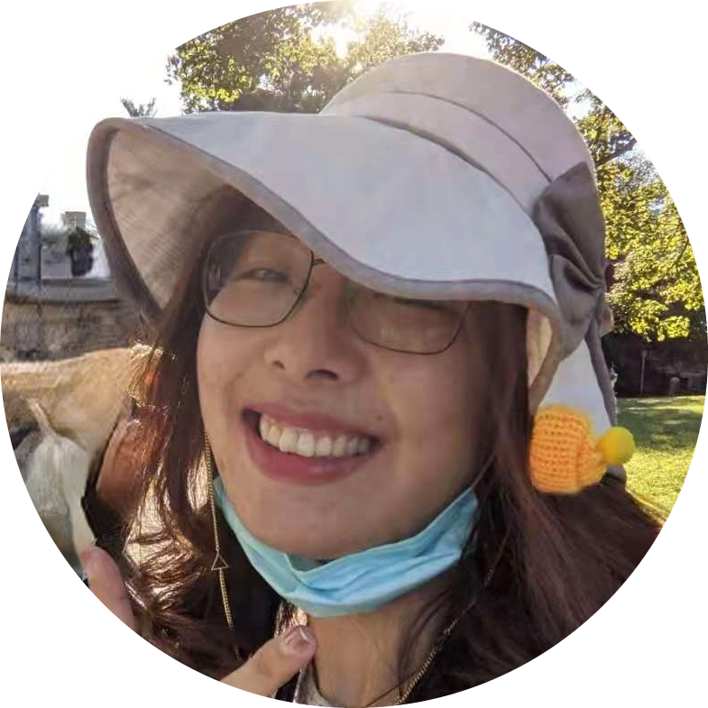
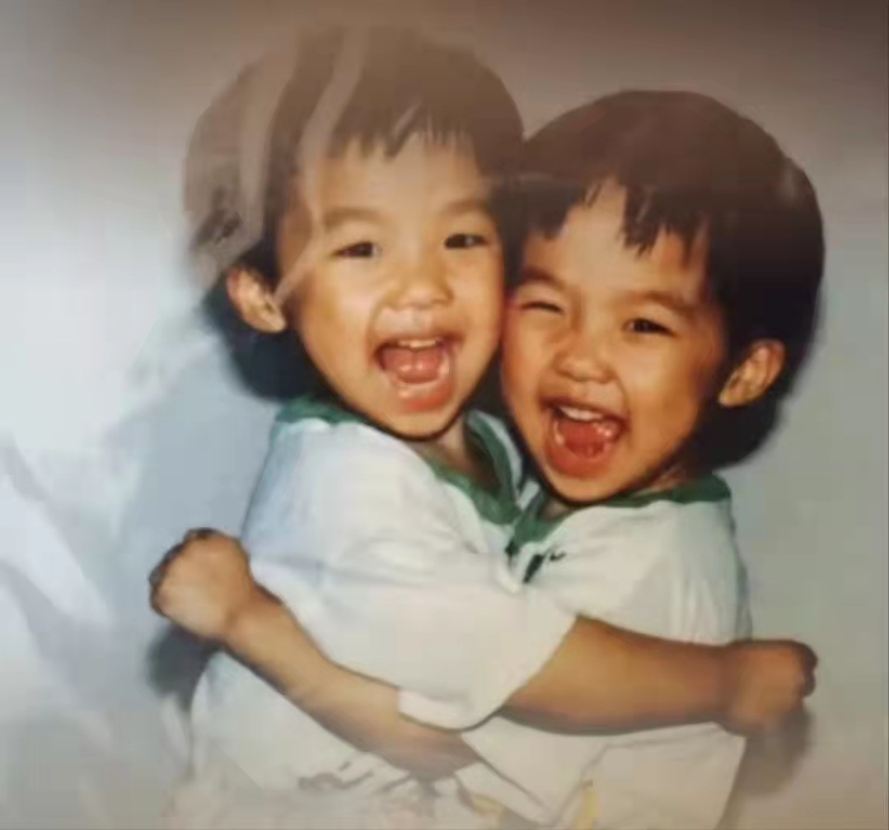
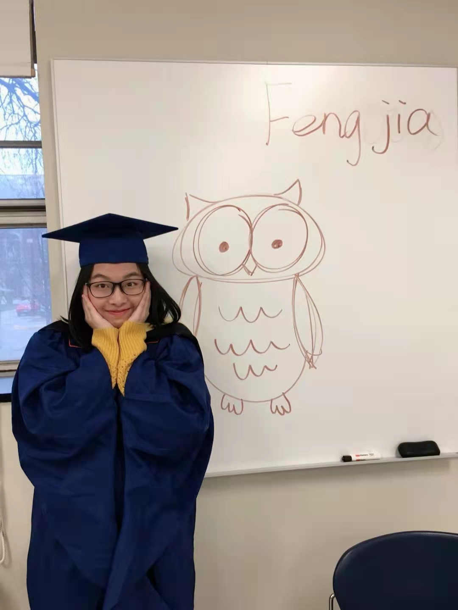
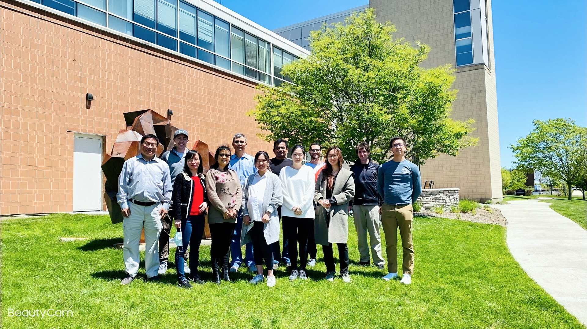
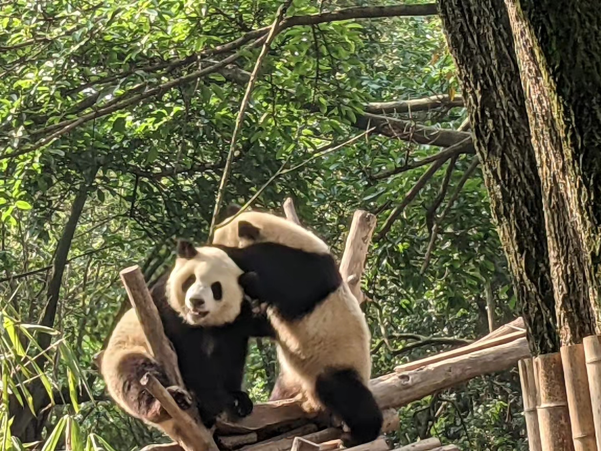
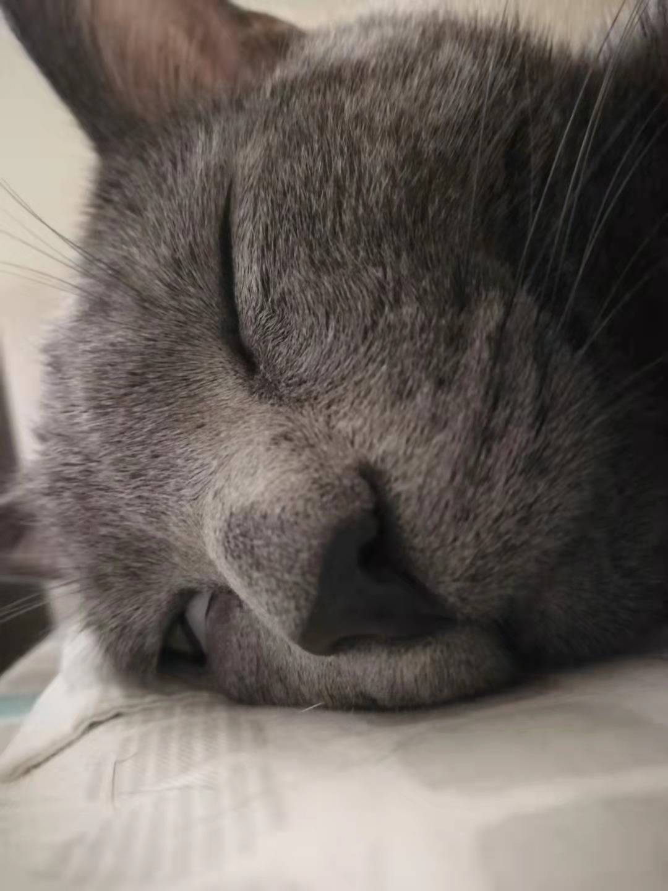
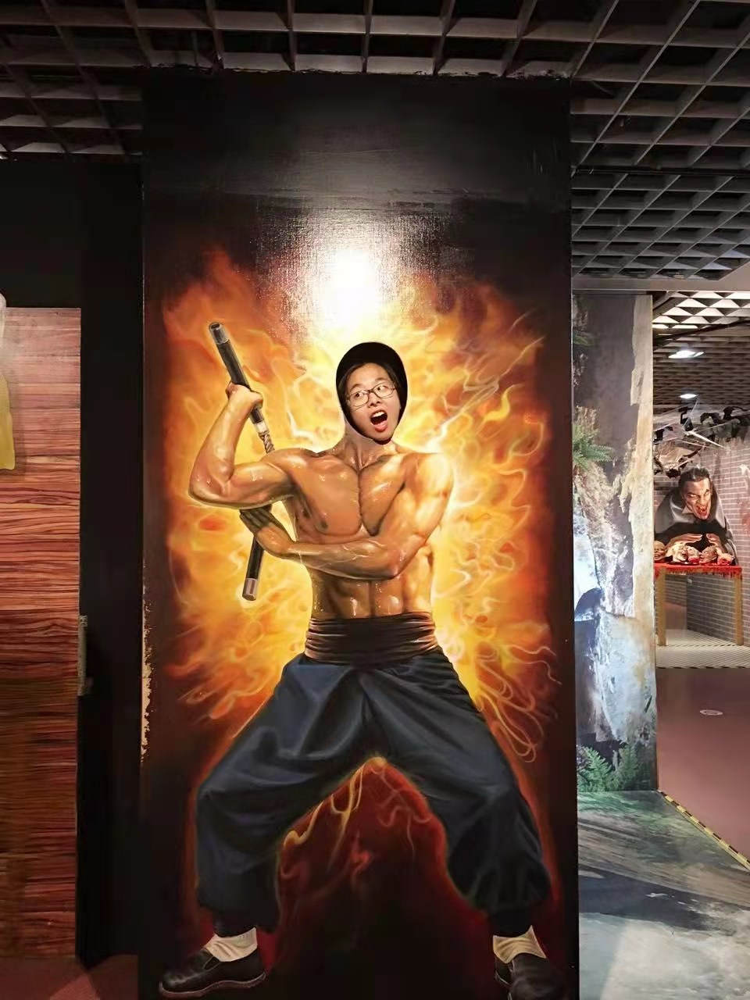
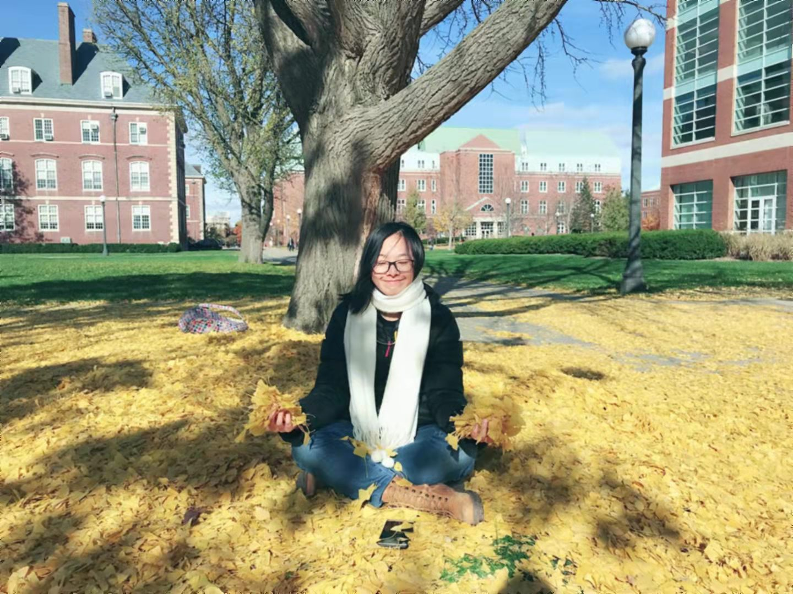

### Biography
</script>
 
Current graduate student in Biostatistics at Columbia University who is expected to graduate in Summer 2023. A motivated and organized employee who can schedule multiple tasks with high efficiency with a proven history of successful work with cross-functional teams. Seeking to leverage my data-analysis skills and cross-intersectional background to effectively fill a Summer Internship role.   

 

*Here is my latest photo after visiting Princeton University. My next trip would be Iceland and Canada, hopefully! My target is to travel as many places as possible while I am still a student, and try to discover and see a different life. * 
   

 
 

**These days...**

  
* A new Columbia Mailoman School Biostatistics MS Student  
* Struggling in Probability    
* A huge progress in R language  
* Prepare to start a brand new career pathway  
* Hope to be a master of Python, R and SAS

   

   

  

**My Past 26 year...**      
* In 1995, I was born as a 1 minute older sister
 
  
* In 2016, I finished all my undergraduate requirements in Zhejiang University. 
 
  
* In 2017, I graduated from UIUC for my master degree. 
 
  
* In 2021, I quit my job and returned to study biostatistics. 
  
 

_Study again is somewhat challenge_, **BUT**...   

* I have traveled to 5 different countries  
* I went back to China this year and saw cute pandas  
   
* I have helped to take care 5 cats  
  
* I could do funny faces  
 
  

**And that is me!**  
_I may not be perfect, but I am perfectly me!_  
  
 

